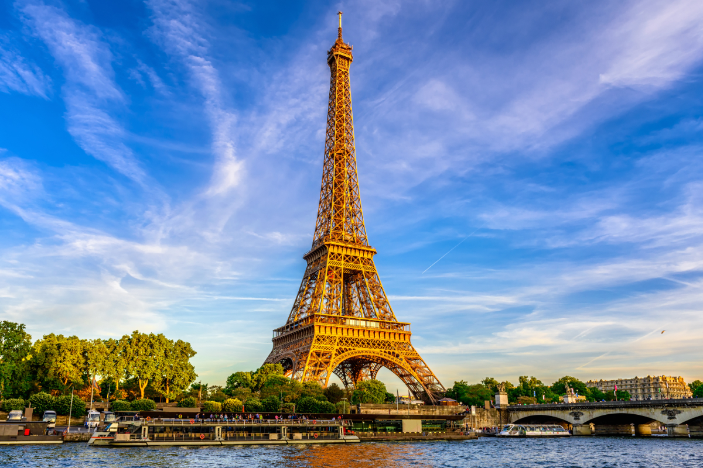

# Neural Artistic Style
Implementation of paper : [A Neural Algorithm of Artistic Style](https://arxiv.org/pdf/1508.06576.pdf)

## What is NST or Neural Style Transfert ? 

The main principle of this technique is to take the "style" of an image (e.g. Painting, Artwork, ..) and apply it to an other image in which we'd to keep its content untouch.

| Content                                                                            | Style                                                                        | Style Transfer                                                                                         |
|------------------------------------------------------------------------------------|------------------------------------------------------------------------------|--------------------------------------------------------------------------------------------------------|
|  |  |  |
